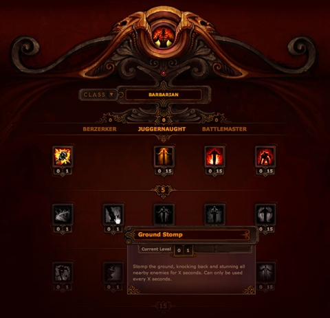

!SLIDE
# Step 4: Level up
## (the apprentice part)

!SLIDE
# Not Internships
## Focus on training

!SLIDE
# Lateral Movement
## Java -> Ruby?

!SLIDE
# Pair Programming
## Start doing this NOW

!SLIDE center
# Keep Track

!SLIDE
# Conferences
## Start going NOW
### uxmad, July 19-21
### Madison Ruby, August 23-25

.notes "hub50" or volunteer for 2 4-hour sessions. $299, $249
